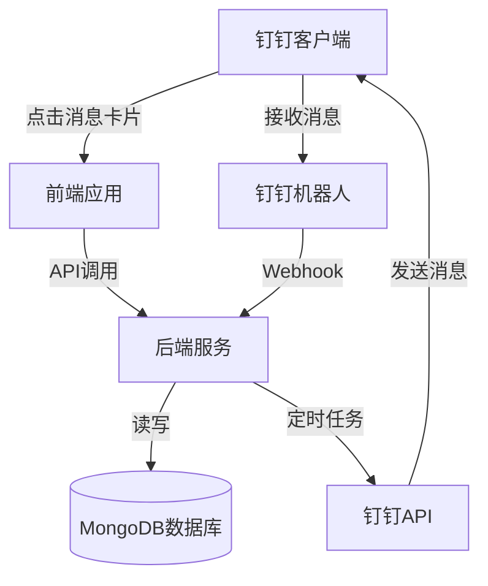
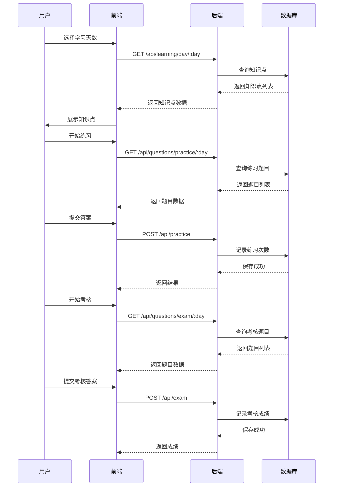
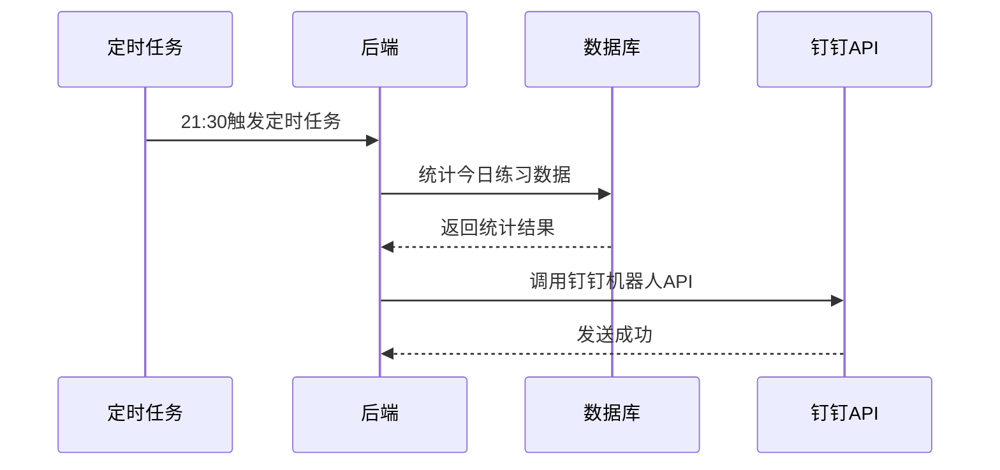
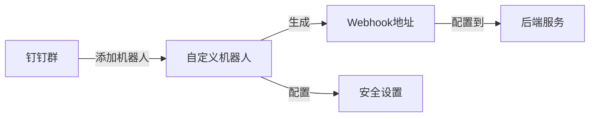

# VIPthink台湾市场课程顾问培训系统 - 技术架构文档

---

## 一、架构概览

### 1.1 整体架构



### 1.2 技术栈

| 分类 | 技术 | 版本 | 说明 |
|------|------|------|------|
| 前端框架 | React | 18.x | UI框架 |
| 语言 | TypeScript | 5.x | 类型安全 |
| 样式 | TailwindCSS | 3.x | CSS框架 |
| 路由 | React Router | 6.x | 路由管理 |
| 状态管理 | React Context | - | 轻量级状态管理 |
| HTTP客户端 | Axios | 1.x | 请求库 |

| 分类 | 技术 | 版本 | 说明 |
|------|------|------|------|
| 后端框架 | Express | 4.x | Node.js框架 |
| 语言 | TypeScript | 5.x | 类型安全 |
| 数据库 | MongoDB | 6.x | NoSQL数据库 |
| ORM | Mongoose | 7.x | MongoDB ODM |
| 定时任务 | node-schedule | 2.x | 任务调度 |
| 钉钉SDK | dingtalk-robot-sdk | 1.x | 钉钉机器人API |

---

## 二、目录结构

### 2.1 项目根目录

```
vipthink-training/
├── frontend/                    # 前端代码
│   ├── src/
│   │   ├── components/         # 公共组件
│   │   ├── pages/              # 页面组件
│   │   ├── services/           # API服务
│   │   ├── types/              # 类型定义
│   │   ├── utils/              # 工具函数
│   │   ├── context/            # 上下文状态
│   │   └── App.tsx             # 主应用入口
│   ├── public/                 # 静态资源
│   ├── package.json
│   └── tsconfig.json
├── backend/                    # 后端代码
│   ├── src/
│   │   ├── controllers/        # 控制器
│   │   ├── models/             # 数据模型
│   │   ├── routes/             # 路由定义
│   │   ├── services/           # 业务服务
│   │   ├── utils/              # 工具函数
│   │   ├── cron/               # 定时任务
│   │   └── app.ts              # 应用入口
│   ├── package.json
│   └── tsconfig.json
├── .env                        # 环境变量
├── docker-compose.yml          # Docker配置
└── README.md
```

### 2.2 前端目录详解

| 目录/文件 | 职责 |
|-----------|------|
| components/ | Button、Card、Progress等公共组件 |
| pages/Home.tsx | 首页/学习进度概览 |
| pages/Learn.tsx | 知识点学习页 |
| pages/Practice.tsx | 闯关练习页 |
| pages/Exam.tsx | 考核测试页 |
| pages/Results.tsx | 成绩汇总页 |
| pages/Admin.tsx | 管理后台页 |
| services/api.ts | API请求封装 |
| types/index.ts | TypeScript类型定义 |
| context/AuthContext.tsx | 用户认证状态 |

### 2.3 后端目录详解

| 目录/文件 | 职责 |
|-----------|------|
| controllers/user.ts | 用户登录、信息管理 |
| controllers/learning.ts | 知识点管理 |
| controllers/practice.ts | 练习管理 |
| controllers/exam.ts | 考核管理 |
| controllers/record.ts | 学习记录管理 |
| models/User.ts | 用户模型 |
| models/LearningRecord.ts | 学习记录模型 |
| models/KnowledgePoint.ts | 知识点模型 |
| models/Question.ts | 题目模型 |
| routes/ | API路由定义 |
| services/dingtalk.ts | 钉钉机器人服务 |
| cron/report.ts | 晚间播报定时任务 |

---

## 三、核心业务流程

### 3.1 学习流程



### 3.2 钉钉播报流程



---

## 四、API接口设计

### 4.1 用户相关

| 接口 | 方法 | 路径 | 描述 |
|------|------|------|------|
| 用户登录 | POST | /api/users/login | 账号密码登录 |
| 获取用户信息 | GET | /api/users/me | 获取当前用户 |
| 用户列表 | GET | /api/users | 获取学员列表（管理员） |

**POST /api/users/login**

请求体：
```json
{
  "phone": "string",
  "password": "string"
}
```

响应体：
```json
{
  "success": true,
  "data": {
    "id": "string",
    "name": "string",
    "phone": "string",
    "role": "student|admin"
  },
  "token": "string"
}
```

### 4.2 学习相关

| 接口 | 方法 | 路径 | 描述 |
|------|------|------|------|
| 获取知识点 | GET | /api/learning/day/:day | 获取当天知识点 |
| 获取练习题目 | GET | /api/questions/practice/:day | 获取练习题目 |
| 获取考核题目 | GET | /api/questions/exam/:day | 获取考核题目 |

### 4.3 练习相关

| 接口 | 方法 | 路径 | 描述 |
|------|------|------|------|
| 提交练习 | POST | /api/practice | 提交练习答案 |
| 获取练习记录 | GET | /api/practice/records | 获取练习记录 |

**POST /api/practice**

请求体：
```json
{
  "day": "number",
  "answers": [
    {
      "questionId": "string",
      "answer": "number"
    }
  ]
}
```

### 4.4 考核相关

| 接口 | 方法 | 路径 | 描述 |
|------|------|------|------|
| 提交考核 | POST | /api/exam | 提交考核答案 |
| 获取考核记录 | GET | /api/exam/records | 获取考核记录 |

### 4.5 学习记录

| 接口 | 方法 | 路径 | 描述 |
|------|------|------|------|
| 获取学习记录 | GET | /api/records | 获取个人学习记录 |
| 获取所有记录 | GET | /api/records/all | 获取所有学员记录（管理员） |

---

## 五、数据库设计

### 5.1 集合结构

#### 5.1.1 users（用户集合）

| 字段名 | 类型 | 说明 |
|--------|------|------|
| _id | ObjectId | 主键 |
| name | string | 用户名 |
| phone | string | 手机号（唯一） |
| password | string | 加密后的密码 |
| role | string | 角色：student/admin |
| createdAt | Date | 创建时间 |
| updatedAt | Date | 更新时间 |

#### 5.1.2 knowledge_points（知识点集合）

| 字段名 | 类型 | 说明 |
|--------|------|------|
| _id | ObjectId | 主键 |
| day | number | 天数（1-4） |
| title | string | 知识点标题 |
| content | string | 知识点内容 |
| order | number | 排序序号 |

#### 5.1.3 questions（题目集合）

| 字段名 | 类型 | 说明 |
|--------|------|------|
| _id | ObjectId | 主键 |
| day | number | 天数（1-4） |
| type | string | 类型：practice/exam |
| question | string | 题目内容 |
| options | array | 选项列表 |
| answer | number | 正确答案索引 |
| explanation | string | 答案解析 |

#### 5.1.4 learning_records（学习记录集合）

| 字段名 | 类型 | 说明 |
|--------|------|------|
| _id | ObjectId | 主键 |
| userId | ObjectId | 用户ID |
| day | number | 天数（1-4） |
| practiceCount | number | 练习次数 |
| examScore | number | 考核成绩（0-100） |
| completed | boolean | 是否已完成 |
| updatedAt | Date | 更新时间 |

### 5.2 索引设计

| 集合 | 字段 | 索引类型 | 说明 |
|------|------|----------|------|
| users | phone | 唯一索引 | 加速登录查询 |
| knowledge_points | day | 普通索引 | 按天查询知识点 |
| questions | day + type | 复合索引 | 按天和类型查询题目 |
| learning_records | userId | 普通索引 | 查询用户学习记录 |
| learning_records | day | 普通索引 | 按天统计 |

---

## 六、钉钉集成

### 6.1 机器人配置



### 6.2 消息格式

**文本消息格式：**
```json
{
  "msgtype": "text",
  "text": {
    "content": "【今日学习播报】\n总练习次数：120次\n平均成绩：85分\n完成人数：25人\n\n详细排名：\n1. 张三 - 练习15次，成绩95分\n2. 李四 - 练习12次，成绩90分"
  }
}
```

### 6.3 安全设置

- **IP白名单**：配置服务器IP地址
- **自定义关键词**：配置"学习"、"播报"等关键词

---

## 七、部署与配置

### 7.1 环境变量

```bash
# 端口配置
PORT=3000

# 数据库配置
MONGODB_URI=mongodb://localhost:27017/vipthink

# JWT配置
JWT_SECRET=your_jwt_secret_key
JWT_EXPIRES_IN=7d

# 钉钉机器人配置
DINGTALK_WEBHOOK=https://oapi.dingtalk.com/robot/send?access_token=xxx
DINGTALK_SECRET=xxx

# 环境标识
NODE_ENV=development
```

### 7.2 Docker配置

```yaml
version: '3.8'
services:
  mongodb:
    image: mongo:6.0
    container_name: vipthink-mongo
    ports:
      - "27017:27017"
    volumes:
      - mongodb_data:/data/db
  
  backend:
    build: ./backend
    container_name: vipthink-backend
    ports:
      - "3000:3000"
    environment:
      - MONGODB_URI=mongodb://mongodb:27017/vipthink
      - PORT=3000
    depends_on:
      - mongodb
  
  frontend:
    build: ./frontend
    container_name: vipthink-frontend
    ports:
      - "80:80"
    depends_on:
      - backend

volumes:
  mongodb_data:
```

---

## 八、安全性考虑

### 8.1 数据安全

- 密码使用bcrypt加密存储
- JWT Token有效期7天
- API接口需Token验证
- 敏感信息通过环境变量管理

### 8.2 访问控制

- 区分学员和管理员角色
- 管理员接口需角色验证
- 学员只能访问自己的学习记录

### 8.3 输入验证

- 前端表单验证
- 后端参数校验
- 防止SQL注入（使用Mongoose）

---

## 九、性能优化

### 9.1 前端优化

- 组件懒加载
- 请求缓存
- 图片压缩
- CDN加速

### 9.2 后端优化

- 数据库索引优化
- 查询缓存（Redis可选）
- 连接池配置
- 定时任务优化

---

## 十、代码规范

### 10.1 前端规范

- 使用ESLint + Prettier
- 组件命名使用PascalCase
- 文件命名使用kebab-case
- 变量命名使用camelCase

### 10.2 后端规范

- 使用ESLint + Prettier
- 函数命名使用camelCase
- 常量命名使用UPPER_CASE
- 接口响应统一格式
